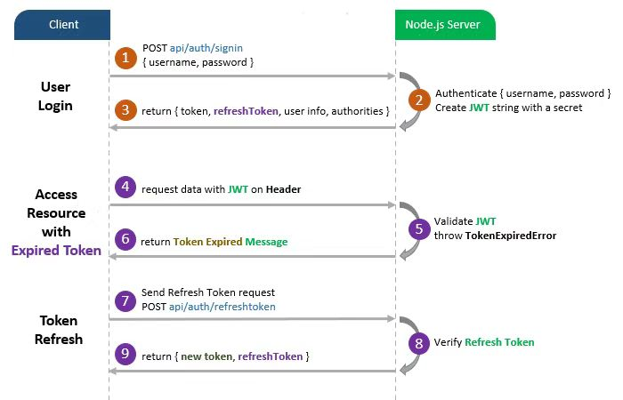

# real-time-chat-具有登录注册验证的在线实时聊天应用程序。

## 项目结构树：
```
real-time-chat
├─ .git
│  ├─ ... (其他 git 文件和文件夹)
├─ .gitignore
├─ babel.config.js
├─ chat.serve.js
├─ database.js
├─ front.server
│  ├─ config
│  ├─ controller
│  ├─ middle
│  ├─ models
│  └─ routes
├─ imags
├─ jsconfig.json
├─ LICENSE
├─ package-lock.json
├─ package.json
├─ public
│  ├─ favicon.ico
│  └─ index.html
├─ README.md
├─ server.js
├─ src
│  ├─ App.vue
│  ├─ assets
│  ├─ components
│  ├─ main.js
│  ├─ pages
│  ├─ plugins
│  ├─ router
│  ├─ store
│  └─ verification
└─ vue.config.js
```


## 项目主要实现的功能：

1. 登录注册的身份验证功能（利用JWT）来实现，在与后端验证的时候，会根据不同的身份显示不同的界面；而且根据不同角色赋予不同的权力，如管理员能查看信息，而普通用户只能登录到公共组件——在线实时俩天应用程序。

2. 多人在线实时聊天功能——前后端之间根据WebSocket来进行实时通信，并且能实现用户界面——显示对面的用户正在打字（xx正在输入中...）；对方离开聊天界面也会提示弹窗、以及能显示多少人进入了聊天室。

### 项目主要用的技术栈：

1. 登录注册验证功能：Vue3+Nodejs+Express+Mysql+router+vuex+Bootstrap+axios+webpack+JWT

2. 在线实时里聊天功能：Vue3+Nodejs+Express+Mysql+Bootstrapwebpack+Websocket


#### 项目主要的演示图以及在线视频：


[运行项目演示视频](https://www.bilibili.com/video/BV1kG411e7k8/?share_source=copy_web&vd_source=c708f03eb587566cec1021e7f1b0ed66)


#### 完成项目时遇到的主要问题：

1. 遇到的第一个问题就是:如何理清客户端与后端服务器的整个交互过程？说实话在做这个项目之前，我对后端仅仅只是了解过，但并未深入，然后服务器也只是会写一点。通常只知道客户端的axios与http请求这些。那一般我做开始敲代码之前都是会先把思路理清，整个框架画出来——如都有哪些功能，顺序分别是？基本用到的技术？如何去找资料来学习？那客户端与服务端我觉得是这样理解的：



2. 第二个问题就是：如何快速学习一下服务器和数据库的相关知识，基本作用？如何编写？它们之间如何交互？下面是它们三者之间的一个交互过程：


3. 第三个问题就是：不是很适应vue3的组合式api开发，总感觉怪怪的，虽然组合式api代码很简洁又省事。我觉得未来的时间里我应该要多写点小项目来练习组合式api开发模式，不然老是写options api开发，代码冗长不说，每次还得切换组件真的大大降低效率。

#### 完成项目的收获：

1. 首先肯定是vue3js的技术得到很多的锻炼，因为在该项目中我使用了不同的vue3 api进行开发，登录注册验证用的是options api开发模式，而在线实时聊天是组合式api开发模式，这两个api的对比下来，肯定后者效率高多了。

2. 其次是让我熟悉了全栈项目的开发流程，以及让自己迈出舒适区，学习和实践了后端的一些技术：nodejs express mysql websocket sequelize（为数据库服务的，类似自动初始化创建数据库表格，比手动好很多哈哈哈！）

3. 最后，我觉得这一点非常重要！调试排查错误！不管是postman api测试，还是客户端开发者工具控制台、服务器日志，我在项目完成基本雏形时算不上很痛苦，但是当我运行整个项目时，不断报错才是成长，因为我会根据报错原因一步步的进行排查和解决问题。比如，sequelize对服务器中生产环境和开发环境的要求是不一样的，但凡你写错了一点点，服务器日志狂报错，客户端却只报错出network error ，控制台也就是常见的refused，但是去逐个排查后发现根本不是客户端的事，而是我把一行代码写成了适应生产环境的格式，然后服务器在我点击send的时候就开始崩溃了... 这只是其中一个例子，自行体会。

4. 最后的最后，我觉得这行真是永远学不完新东西，人外有人，天外有天。当自己完成项目喜悦感冷静下来后，就得要深思，我拿什么跟人家去竞争呢？我觉得前端最重要的不是框架，而是原生js，框架用的再好，还不如多打好js基础，只有很熟练了，不管出什么新框架，或者大更新，其本质从未变过。

未来的日子会更重视js、typescript、python这些，希望自己能在这条路上走得远一些。

#### 最后的上线部署：

- 因数据库涉及个人信息太多，加上该项目涉及两个数据库和服务器，部署起来需要一些时间，暂时先不部署上线，过几天忙完就弄好；感兴趣的小伙伴可以看看我的在线运行项目演示视频！


##### 联系我：

- 喜欢捣鼓项目、喜欢一起学习探讨计算机语言或者喜欢讨论ai技术发展的小伙伴们，欢迎加我联系方式：


- GitHub: [katyjohn124](https://github.com/katyjohn124)


## Project setup
```
npm installzhanshi
```

### Compiles and hot-reloads for development
```
npm run serve
```

### Compiles and minifies for production
```
npm run build
```

### Lints and fixes files
```
npm run lint
```

### Customize configuration
See [Configuration Reference](https://cli.vuejs.org/config/).
